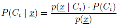
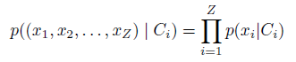

#Fragen zu Versuch 4: Dokument Klassifikation / Spam Filter

## 1.4.1 Wie wird ein Naiver Bayes Classifier trainiert?
Ein Naiver Bayes Classifier kann nur überwacht trainiert werden.  

Für jeden Trainingsdatensatz mit einer Menge von Variablen x muss jeder Wert einer Klasse C_i zugeordnet werden können.

    # Wahrscheinlichkeit für jede Klasse C_i das x teil von C_i ist
    # und wähle jeweils die Klasse mit größten Wahrscheinlichkeit aus
    P(C_i | x)

Die Berechnung erfolgt über die Bayes Formel wobei:

    P(C_i | x) # a-postprioi-Wahrscheinlichkeit
    p(x | C_i) # Ermittelt mit Likelihood Funktion
    P(C_i)  #a-priori-Wahrscheinlichkeit
    p(x) # Evidenz (Größe irrelevant)

  
Hat man für die Variable x eine Klassifikation zur Klasse C_i geschaffen, kann man neue Elemente nach diesen Kriterien testen.  
Der Naive Bayes Classifier trainiert überwacht, aus der Aufgabenstellung arbeitet der parametrische-Ansatz mit bestehenden Wahrscheinlichkeitswerten.

## 1.4.2 Wie teilt ein Naiver Bayes Classifier ein neues Dokument ein?

### marc:
Der Naive Bayes Classifier berechnet für jede Klasse die a-posteriori-Wahrscheinlichkeit, dass das Dokument zu dieser Klasse gehört.  
Dabei werden alle Wörter des Dokuments mit Wörtern, die in Dokumenten der Klasse vorkommen verglichen und anhand dieser ein Wert zwischen 0 und 1 ausgegeben.  
Mit einbezogen wird auch die bisherige Verteilung der Dokumente auf Klassen.  

A-posteriori-Wahrscheinlichkeit `P(G|D)`:

	P(G|D) = ( p(D|G) * P(G) ) / p(D)

Likelihood Funktion:
	
	p(D|G) = product( P(w|G) ) #für alle Wörter w in Dokument D

Wahrscheinlichkeit P(w|G):
	
	P(w|G) = Anzahl Dokumente mit Wort w in Kategorie G / Anzahl aller Dokumente in Kategorie G

A-priori-Wahrscheinlichkeit:

	P(G) = Anzahl der Dokumente in Kategorie G / Anzahl aller Dokumente
	
Evidenz `p(D)` bleibt immer gleich und kann ignoriert werden.

###Flo:

Es wird für jede Klasse ein Anteil an der Gesamtmenge ermittelt.
(Formel 7 und 8, sind nicht gekennzeichnet im pdf)

	Anzahl der Elemente mit Klasse C / Anzahl aller Elemente der Menge
	
Hier wird die Formel für P(C) angegebenen,
dabei muss diese Wahrscheinlichkeit für jede Kategorie C ermittelt werden.

Es wird für die Likelihood Funktion nun aus den Trainingsdaten die Werte P(x|C) für jeden Wert x Ermittelt.
(Formel 3 und 4)
(Anzahl der Dokumente in denen die Kategorie C das Wort x enthält) / (Anzahl der Dokumente die zur Kategorie C gehören)

Nun kann wieder die a-postpriori-Wahrscheinlichkeit in Bezug zur gelernten Likelihood gelernt werden.
(Formel 5 und 6)
p(D) bleibt dabei immer gleich.

## 1.4.3 Welche naive Annahme liegt dem Bayes Classifier zugrunde?

Der Naive Bayes Classifier geht davon aus, dass alle Variablen unabhängig voneinander sind.
Wären sie abhängig, würde sich die Likelihood Funktion weitaus schwerer berechnen lassen.

Mit der vereinfachten Annahme lässt sich alles auf die Formel (2) reduzieren.

(wobei die Evidenz p(D) vernachlässigt werden kann)

## 1.4.4 Ist diese Annahme im Fall der Dokumentklasifikation tatsächlich gegeben?

Der Naive Bayes Classificator richtet sich sehr stark an der Anzahl von Worten in Dokumenten aus.
Für eine Klassifikation wie in der Vorbereitung in Spam oder Nicht-Spam ist diese Annahme anwendbar.  
Für Dokumenten mit stark variierenden Wortanzahlen ist er nicht sinnvoll einsetzbar.  

Generell kann der Bayes Classificator auch nicht dazu verwendet werden, um Schreibstile oder den Kontext des Dokuments zu erkennen.

## 1.4.5 Betrachten Sie die Formeln 5 und 6. Welches Problem stellt sich ein, wenn in der Menge W(D) ein Wort vorkommt, das nicht in den Trainingsdaten der Kategorie G vorkommt und ein anderes Wort aus W(D) nicht in den Trainingsdaten der Kategorie B enthalten ist= Wie könnte dieses Problem gelöst werden?

Das Problem erzeugt einen Fehler in der Formel, da das Produkt eine der Likelihood damit eine Null enthält.
Man könnte für diesen Fall den Wert 0.5 für beide Kategorien wählen, damit währe eine Gleichverteilung gegeben.
Man könnte alternativ auch das Wort ausklammern und anschließend in eine neue Trainingsbildung einfließen lassen,
wobei die Wahrscheinlichkeit auf der Klassifikation der anderen Elemente des Dokuments beruht.

----

#3 Fragen zum Versuch
1. Was wird mit Evidenz bezeichnet und warum muss diese für die Klassifikation nicht berücksichtigt
werden?
Evidenz ist p(x) und ist für die Klassifikationsentscheidung nicht relevant, da sie für alle Klassen Ci gleich groß ist.

2. Wann würden Sie in der Formel für die gewichtete Wahrscheinlichkeit den Wert von initprob kleiner,
wann gröÿer als 0.5 wählen? (Falls Sie die Möglichkeit haben diesen Wert für jedes Feature und jede
Kategorie individuell zu konfigurieren)

3. Was könnten Sie mit dem in dieser Übung implementierten Classifier noch klassifizieren? Geben Sie
eine für Sie interessante Anwendung an.

4. Das einmal trainierte, sollte eigentlich persistent abgespeichert werden. Beschreiben Sie kurz wie
Sie das für dieses Programm machen würden.