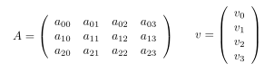
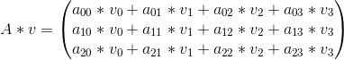
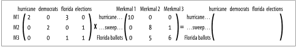

#Links

http://books.google.de/books?id=nAIkkWi1yJEC&lpg=PT276&ots=F4tDaGKZ-U&dq=nichtnegative%20matrixfaktorisierung&hl=de&pg=PT276#v=onepage&q=nichtnegative%20matrixfaktorisierung&f=false

#Fragen zu Versuch 5: 
##Merkmalsextraktion mit der Nicht-Negativen Matrixfaktorisierung

###Was versteht man unter Artikel/Wort-Matrix? Wie sieht diese im aktuellen Versuch aus?
Eine Artikel/Wort-Matrix besteht aus einem Vektor i für die Dokumente und einem Vektor j für die Worte.
Dabei sind die Worte in mindestens einem Dokument enthalten.

In diesem Versuch verwenden wir die Nicht-Negative Matrix Faktorisierung.
Hierbei werden die Worte auf thematisch Relevante Worte reduziert.
Dabei fallen Füllworte weg, und eine Gewichtung für bestimmte Keywords kann gelegt werden.

###Wie multipliziert man die Matrix A mit dem Vektor v?

Bei der NNMF wird die Rechnung aufgeteilt.
A ist hierbei:

    A = W * H

###Was versteht man im Kontext der NNMF unter
####Merkmalsmatrix
Aus dem Skript, die Matrix H

Beschreibt aus welchen Worten die Merkmale gebildet werden.
Ein Merkmal ist hierbei, beispielsweise ein Topic. 
Jede zeile ist ein Topic, und jede Spalte ist ein Wort.
Nun wird jeder Topic/Wort kombination ein Gewicht zugeordnet.
Beispiel: Kochen: Salz 5, Auto 0

####Gewichtsmatrix

Aus dem Skript, die Matrix W

Beschreibt mit welchem Gewicht die Merkmale in den jeweiligen Artikeln auftreten.
Jede Zeile ist ein Artikel und jede Spalte ein Merkmal.
Jeder Artikel/Merkmal Kombination wird nun eine Gewichtung zugeordnet.
Beispiel:
"Wie Kochen unser leben bereichert" : Kochen 5
"Warum Autos noch nicht fliegen" : Kochen 0

###Wie definieren die Zeilen der Merkmalsmatrix die einzelnen Merkmale (Topics)?

Mit Stichworten zu einem Topic:
Bsp.:{Obama, visit, Germany}
Dieser Vektor enthält die Wörter aus welchen die Merkmale gebildet werden.
Es werden also Merkmale auf Wörter abgebildet.

Topic == Merkmal
Jede Zeile ist ein Topic, jede Spalte ist ein Wort zu diese Topic.
Die Werte geben die Wichtigkeit eines Wortes zu einem Topic an. 
Beispiel: Topic: Spielkonsolen Schlüsselwort mit hohem Wert: "Controller"

###Was definieren die Zeilen der Gewichtungsmatrix?

Die Zeilen der Gewichtungsmatrix bildet die Artikel ab, die Spalten sind Merkmale.
Jeder Wert eines Merkmals zu einem Artikel gibt dessen Gewicht im Artikel an.
Beispiel: Artikel: Wie man Sushi kocht! Merkmal: Kochen -> gewicht hoch

H*W=A

###Wie werden in Numpy zwei Arrays (Typ numpy.array)
####im Sinne der Matrixmultiplikation miteinander multipliziert?
(x2t it trotzdem elementweise glaube ich)

    import numpy as np
    x1 = np.matrix("0,1,2; 3,4,5; 6,7,8")
    x2 = np.matrix("0,1,2")
    x2t = x2.T
    print x1*x2t

(arrays casten und dann .dot ist doch schöner oder?)
    
	import numpy as np
    x = np.array( ((3,2,1), (1,0,2)) )
    y = np.array( ((1,2), (0,1), (4,0)) )
    print np.dot(x,y)
	print np.mat(x) * np.mat(y)

####elementweise multipliziert?**

    import numpy as np
    x = np.arange(9).reshape((3,3))
    y = np.arange(3)
    print np.dot(x,y)

(elementweise ist default bei array multiplikation)
    
	x = np.array( ((3,2,1), (1,0,2)) )
    y = np.array( ((1,2,3), (4,5,6)) )
    print x * y

###Wie wird die Transponierte eines Numpy-Arrays berechnet?

    import numpy as np
    xTest = np.arange(9).reshape((3,3))
    xTrans = np.transpose(xTest)
    print xTest
    print xTrans

(geht auch mit .T)

	import numpy as np
	import pprint as pp
	x = np.array( ((1,2,3), (4,5,6)) )
	pp.pprint(x)
	pp.pprint(x.T)